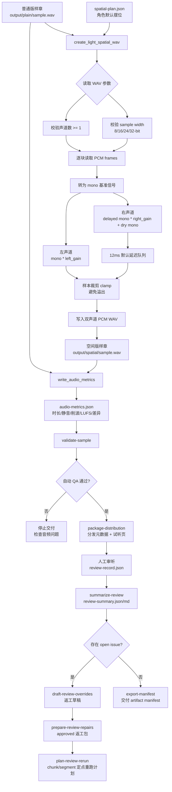

# 音频空间化流程图

```mermaid
flowchart TD
  A[普通版样章<br/>output/plain/sample.wav] --> B[create_light_spatial_wav]
  C[spatial-plan.json<br/>角色默认摆位] --> B

  B --> D{读取 WAV 参数}
  D --> E[校验声道数 >= 1]
  D --> F[校验 sample width<br/>8/16/24/32-bit]
  E --> G[逐块读取 PCM frames]
  F --> G

  G --> H[转为 mono 基准信号]
  H --> I[左声道<br/>mono * left_gain]
  H --> J[右声道<br/>delayed mono * right_gain + dry mono]
  J --> K[12ms 默认延迟队列]
  I --> L[样本裁剪 clamp<br/>避免溢出]
  K --> L

  L --> M[写入双声道 PCM WAV]
  M --> N[空间版样章<br/>output/spatial/sample.wav]

  A --> O[write_audio_metrics]
  N --> O
  O --> P[audio-metrics.json<br/>时长/静音/削波/LUFS/差异]
  P --> Q[validate-sample]
  Q --> R{自动 QA 通过?}
  R -- 否 --> S[停止交付<br/>检查音频问题]
  R -- 是 --> T[package-distribution<br/>分发元数据 + 试听页]

  T --> U[人工审听<br/>review-record.json]
  U --> V[summarize-review<br/>review-summary.json/md]
  V --> W{存在 open issue?}
  W -- 是 --> X[draft-review-overrides<br/>返工草稿]
  X --> Y[prepare-review-repairs<br/>approved 返工包]
  Y --> Z[plan-review-rerun<br/>chunk/segment 定点重跑计划]
  W -- 否 --> AA[export-manifest<br/>交付 artifact manifest]
```
