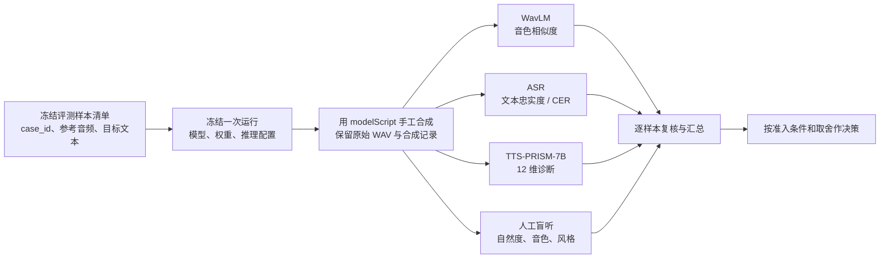

# TTS 模型评估步骤指南

## 目的与范围

本指南用于手工比较 `modelScript/` 中可运行的文本转语音（TTS）模型。它不安装模型、不启动评估脚本，也不替代模型自己的安装指南；它只规定一次可复现评估应准备什么、依次做什么、如何解释结果。

评估对象是“模型 + 权重版本 + 推理配置 + 参考音频策略”的组合，而不是抽象模型名。改变其中任一项，都应新建一次 `run`（运行）。

## 从第一性原理出发

语音合成的“好”至少由五件不能互相替代的事组成：

1. **文本忠实度**：目标文本是否被完整、正确地说出；由 ASR 的转写与 CER 提供证据。
2. **目标音色贴合度**：生成声音是否保持参考说话人的身份特征；由 WavLM 说话人相似度提供证据。
3. **可感知质量与韵律**：是否清晰、发音正确、停顿和语速自然；由 TTS-PRISM-7B 的分维诊断和回听提供证据。
4. **长程稳定性与任务风格**：长文本中音色、风格、情绪是否漂移；由专门的长样本和人工盲听提供证据。
5. **工程可用性**：失败率、合成耗时、显存占用和输出格式是否可接受；由合成记录提供证据。

任何单项分数都不能推出总体结论：高 WavLM 分数的音频仍可能漏读，高 ASR 分数的音频仍可能机械，高 TTS-PRISM 分数也仍需人耳确认。因此先固定事实，再平行取证，最后按决策目标比较。

## 评估流程



## 0. 一次性建立基准集

### 0.1 准备样本，而非先跑模型

1. 将获授权的参考音频存放到本地 `tts-bench/datasets/audio/`。该目录被 Git 忽略，不提交大音频或含个人信息的素材。
2. 为每段参考音频准备人工核对过的转写；这份转写用于说明参考说话人，不可由 ASR 临时生成。
3. 为每个 `case`（评测样本）写定目标合成文本。每个文本应至少覆盖一个预先声明的维度：音色、清晰度、发音、韵律、一致性、表现力或长文本稳定性。
4. 按用途分为 `calibration`（校准集）、`development`（开发集）和 `holdout`（保留集）。开发集可以迭代参数；保留集在候选方案冻结后只用于最终一次比较。
5. 从 [`tts-bench/manifests/case.example.jsonl`](tts-bench/manifests/case.example.jsonl) 复制出清单，使用稳定、不复用的 `case_id`。字段以 [`benchmark-case.schema.json`](tts-bench/contracts/benchmark-case.schema.json) 为准。

建议先用少量覆盖不同难点的校准样本打通流程，再扩大开发集。不要从合成效果中挑选“听起来容易”的文本来替代预先冻结的样本。

### 0.2 冻结前的人工检查

- 参考音频与转写对应，目标文本已经校对；
- 所有候选模型使用相同 `case_id`、相同参考音频和相同目标文本；
- 明确长文本是否允许模型内部切分，以及切分策略是否属于待比较的配置；
- 记录素材来源、使用授权和脱敏状态，但不把敏感原始信息写入运行日志；
- 为清单取版本名，例如 `cases-2026-07-v1.jsonl`。保留集一经使用不得原地修改。

## 1. 冻结一次模型运行

对每个候选组合创建唯一 `run_id`，例如 `20260711-qwen3-tts-r01`。从 [`tts-bench/templates/run.example.yaml`](tts-bench/templates/run.example.yaml) 复制为：

```text
tts-bench/runs/<run_id>/run.yaml
```

在该文件及同目录的 `config.snapshot.*` 中记录：

- 模型 ID、权重版本或修订号；
- 对应的 `modelScript/` 推理入口；
- 参考音频、随机种子、采样参数、分段策略和所有会影响声音的参数；
- 冻结清单路径和所用样本分组；
- 本仓库提交号；若工作区未提交，明确标为 `dirty`；
- 硬件、精度和运行环境的可比较信息。

不要把 API Key、令牌、绝对机器路径或个人数据写入快照。模型安装和本地环境仍以 `modelScript/` 中对应安装指南为准。

## 2. 手工合成并登记证据

使用选定模型在同一冻结清单上手工调用 `modelScript/` 的对应脚本。每个成功产物放在：

```text
tts-bench/runs/<run_id>/audio/<case_id>.wav
```

原始输出必须保留；不要为了适配评价器而覆盖或重新编码原始 WAV。若评价器需要单声道或 16 kHz 文件，生成可追溯的派生副本。

然后在 `tts-bench/runs/<run_id>/synthesis.jsonl` 逐行登记。每行符合 [`synthesis-record.schema.json`](tts-bench/contracts/synthesis-record.schema.json)，至少包含：

- `run_id` 与 `case_id`；
- 成功、失败或排除状态；
- 输出 WAV 的相对路径、SHA-256、采样率、声道数、时长；
- 墙钟耗时、设备与可用的峰值显存；
- 推理脚本、配置 SHA-256、清单路径与模型版本。

失败也必须登记：记录 `status=failed` 和可解释的 `failure_reason`。不要悄悄删掉失败样本后只对成功片段求平均；失败率本身就是工程可用性证据。

### 2.1 合成准入检查

在开始自动评分前，对每条 `status=complete` 的记录检查：

- 音频可打开，时长大于零，哈希与登记值一致；
- 路径与 `case_id` 一一对应，不发生覆盖；
- 没有把参考音频误登记为合成音频；
- 没有使用超出冻结配置的人工后处理；如确有后处理，应作为新的运行；
- 长文本样本的段落拼接、静音插入与失败重试策略已有记录。

## 3. 取得自动评价证据

四类评价可独立执行，但都必须只读原始合成音频、保留评价器版本，并且按 `run_id`/`case_id` 写逐样本结果。

### 3.1 WavLM：目标音色贴合度

按 [`wavlm/README.md`](wavlm/README.md) 的约定，将同一个 `case_id` 的参考音频与合成音频配对，统一派生为单声道 16 kHz 输入，再计算说话人嵌入的余弦相似度（SIM）。

- 固定带说话人验证头的检查点、权重修订号和嵌入聚合方式；
- 固定 `preprocessing_id`，不要对不同模型使用不同裁静音或响度策略；
- 先观察同说话人与不同说话人的校准对，确认结果方向和异常范围；
- 输出到 `wavlm/outputs/<run_id>/similarity.jsonl`，符合 [`similarity-record.schema.json`](wavlm/contracts/similarity-record.schema.json)。

SIM 只能在同一检查点、同一预处理、同类样本内相对比较。它不是“像不像”的通用百分比，也不能反映文本是否正确。

### 3.2 ASR：文本忠实度

使用一个固定的 ASR 模型转写合成音频。将原始转写与评测清单的 `target.text`（不是参考音频转写）按同一规则规范化，计算 CER。

- 配置见 [`asr/config/transcription.example.yaml`](asr/config/transcription.example.yaml)；
- 中文规范化使用 [`asr/normalization/zh-v1.md`](asr/normalization/zh-v1.md)；
- 保存原始转写、两侧规范化结果、CER 以及可选 WER；
- 输出到 `asr/outputs/<run_id>/transcription.jsonl`，符合 [`transcription-record.schema.json`](asr/contracts/transcription-record.schema.json)。

CER 越低越好，但它不衡量自然度或音色。数字、专名和英文混读的规则必须在运行前冻结，不能看到结果后临时放宽。

### 3.3 TTS-PRISM-7B：细粒度诊断

按 [TTS-PRISM 官方仓库](https://github.com/xiaomi-research/tts-prism) 当时的输入要求手工执行诊断；本仓库只提供输入映射、配置模板与结果格式。

1. 填写 [`tts-prism-7b/config/diagnosis.example.yaml`](tts-prism-7b/config/diagnosis.example.yaml) 的模型和 audio tokenizer（音频分词器）修订号。
2. 仅输入本次运行成功合成的普通话样本，保留官方模型的原始回答。
3. 将能可靠解析的 12 项分数写入 `tts-prism-7b/outputs/<run_id>/diagnosis.jsonl`，字段遵循 [`diagnosis-record.schema.json`](tts-prism-7b/contracts/diagnosis-record.schema.json)。
4. 若回答无法解析、模型报错或样本不适用，保留原始信息并标注失败；不要填零或主观补分。

基础能力八项以 1–5 单独分析，高级表现力四项以 0–2 单独分析。模型给出的理由用于发现问题位置，最终仍要回听原始音频。

### 3.4 通用指标索引

在 `tts-bench/runs/<run_id>/metrics/` 为每个评价器写一个索引记录，使用 [`metric-record.schema.json`](tts-bench/contracts/metric-record.schema.json) 指向评价器的逐样本文件。这样，汇总者无需猜测文件名，也能确认评价结果对应哪一个合成 WAV 哈希。

## 4. 开展人工盲听

自动指标完成后，按 [`listener-review/README.md`](listener-review/README.md) 组织盲听：

1. 管理员为每个候选音频分配不含模型信息的 `blind_id`，私有映射保存在 `listener-review/private-mapping/`，直到收齐评分才解盲。
2. 从 [`blind-playlist.example.csv`](listener-review/forms/blind-playlist.example.csv) 生成每位听评者随机顺序的播放列表；同一模型的样本不要连续出现。
3. 先播放校准样本，让听评者理解量表；校准分不用于候选排名。
4. 每个有效样本由同一听评者只评一次，使用 [`review-form.example.csv`](listener-review/forms/review-form.example.csv) 记录自然度、音色贴合度、可懂度、风格适配度和无伪影程度。
5. 无法播放、错样本或明显不符合任务的记录标记 `valid=false`，保留原因，不以缺失分数替代。

评分锚点见 [`listener-review/rubric.md`](listener-review/rubric.md)。评分者看到的材料不应包含模型名、运行目录名、推理参数或其他可能破盲的信息。

## 5. 汇总、复核与决策

从逐样本记录，而不是从印象或单个均值开始。用 [`tts-bench/templates/scorecard.csv`](tts-bench/templates/scorecard.csv) 做展示性汇总，并在 `tts-bench/reports/` 写清楚版本、样本数、排除原因和决策。

### 5.1 先过准入门槛

在比较偏好前，先检查：

- 合成失败率、无效音频和未解释的排除是否可接受；
- 是否所有候选都使用同一清单、同一模型版本的评价器和同一预处理；
- 是否有保留集结果，且保留集未被用于反复调参；
- 是否存在明显的文本错误、伪影或长程漂移；这些错误不能被平均分掩盖。

项目负责人应基于校准集和真实使用场景在运行前声明阈值；本骨架不硬编码一个“万能合格分”，避免把特定数据集的数值误当成通用标准。

### 5.2 再比较取舍

对于通过准入的候选，至少并列呈现：

- WavLM 的逐样本分布、均值和异常值，而非只写一个 SIM；
- ASR 的 CER、代表性错误转写与长文本失败情况；
- TTS-PRISM-7B 的 12 个维度，分别展示基础能力与表现力；
- 各人工维度的均值、评分人数、分歧和具体听感评论；
- 真实时长、合成墙钟耗时、实时率（RTF）和失败重试成本。

不要把不同量纲的分数直接加权成“唯一总分”，除非业务方预先书面定义权重、方向和最低门槛。更稳健的做法是：先排除不达标项，再在满足约束的候选中选择最符合场景的帕累托最优解（没有其他候选能在所有关键维度同时更好）。

### 5.3 决策记录应能回答

最终报告至少能回答：

1. 选中的到底是哪一版模型、哪一份推理配置和哪套参考音频策略？
2. 它在哪些样本、哪些维度优于备选，哪些地方仍然较弱？
3. 这个结论基于开发集还是一次未调参的保留集？
4. 结果能否从 `run.yaml`、`synthesis.jsonl`、逐样本评价文件和原始 WAV 复现？
5. 为上线或下一轮迭代保留了哪些明确风险与待办？

## 目录速查

| 目标 | 位置 |
| --- | --- |
| 冻结样本清单 | `tts-bench/manifests/` |
| 本地参考音频 | `tts-bench/datasets/audio/`（不提交） |
| 一次运行的配置和合成记录 | `tts-bench/runs/<run_id>/` |
| 音色相似度 | `wavlm/outputs/<run_id>/` |
| ASR/CER | `asr/outputs/<run_id>/` |
| 12 维诊断 | `tts-prism-7b/outputs/<run_id>/` |
| 人工评分材料 | `listener-review/forms/` |
| 展示性汇总与结论 | `tts-bench/reports/` |

## 参考边界

- [WavLM 官方实现](https://github.com/microsoft/unilm/tree/master/wavlm) 提供语音通用表征与说话人验证相关基线；本项目将其限于音色相似度证据。
- [TTS-PRISM-7B 模型卡](https://huggingface.co/xiaomi-research/TTS-PRISM-7B) 定义普通话 TTS 的 12 维诊断量表；本项目保留其原始输出以支持复核。
- [公开零样本 TTS 评估协议](https://github.com/keonlee9420/evaluate-zero-shot-tts) 说明了将说话人相似度与 WER/CER 分开记录的实践；本项目在此基础上增加可解释诊断与人工盲听。
